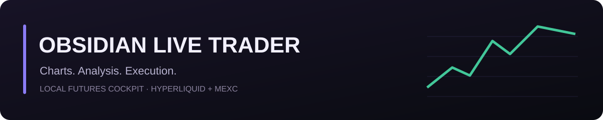
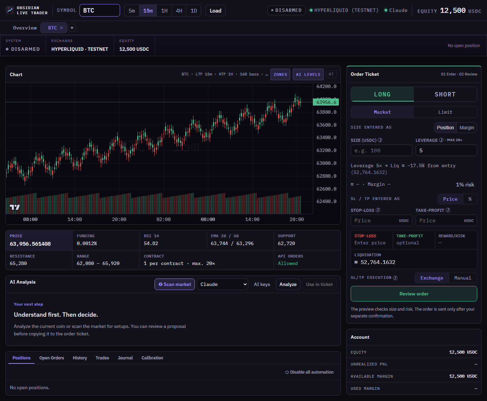

<p align="center">
  
</p>

# Obsidian Live Trader

[](https://github.com/Chap0815/ObsidianLiveTrader/actions/workflows/checks.yml)
[](https://www.python.org/)
[](LICENSE)

**Your charts. Your decisions. Your account.**

A local futures trading cockpit for Hyperliquid perpetuals and optional MEXC
USDT-M. It combines charts, market data, AI-assisted analysis, market scanning,
server-side risk checks, order execution, position management, and a journal in
one FastAPI web interface.

[Get started](#quick-start-on-windows) · [Support](SUPPORT.md) ·
[Security](SECURITY.md) · [Changelog](CHANGELOG.md) · [License](LICENSE)



*Offline demonstration with synthetic prices and account values.*

## What you can do

- Follow live charts, indicators, market structure, funding and account status.
- Scan markets and request advisory analysis from Claude, Grok, OpenAI or local
  Ollama. AI use is optional; provider API access is configured separately.
- Build an order ticket, review server-side risk checks, then explicitly confirm.
- Monitor exchange-side protection and opt into position-specific break-even
  and trailing rules.
- Review fills, trade history, journal outcomes and analysis calibration.

> There is no paper-trading mode. Hyperliquid Testnet uses test funds;
> Hyperliquid Mainnet and MEXC use real funds. Trading is disabled by default.

## Quick start on Windows

Requirements: Python 3.11 or newer and an internet connection for the first
dependency install.

1. [Download the source ZIP](https://github.com/Chap0815/ObsidianLiveTrader/archive/refs/heads/main.zip)
   and extract it into its own folder, or clone this repository. Double-click
   `start.bat` in that folder, or run:

   ```powershell
   .\start.bat
   ```

2. On the first launch, the browser opens the guided setup automatically.
3. Choose Hyperliquid Testnet for the safest first run and enter a trade-only
   agent/API-wallet key. Never grant withdrawal or transfer permissions.
4. Save the setup. The dashboard opens immediately.

Later launches use the same `start.bat`. The launcher creates an isolated
`.venv`, installs packages only there, creates a safe bootstrap `.env`, and
opens the correct local page. Do not copy `.env.example` for the normal first
run; it is a reference for manual configuration.

Default URL: <http://127.0.0.1:8787>

Health check: <http://127.0.0.1:8787/api/health>

If Python opens the Microsoft Store instead, install Python 3.11+ from
<https://www.python.org/downloads/> and disable the Windows app-execution
aliases for `python.exe` and `python3.exe`. For an offline retry after a
successful first install, use `start.bat --skip-install`.

## Safe operating flow

1. Load a symbol or choose one from the market scan.
2. Run AI analysis and review the proposal.
3. Explicitly copy the proposal into the order ticket.
4. Review the order preview and every risk gate.
5. Confirm only when trading has deliberately been armed.
6. Monitor the position and its exchange-side SL/TP protection.

AI is advisory only. It cannot bypass risk gates or submit an entry by itself.
Auto break-even and trailing rules require a separate per-position opt-in.

## Safety model

- Every confirmation needs a fresh preview and a short-lived one-time token.
- Risk gates run again at confirmation with fresh account and market data.
- Invalid or non-finite financial values fail closed.
- Entries require stop protection by default; unverified protection triggers
  the configured emergency handling.
- Stop replacement places and verifies the new stop before removing the old.
- Hyperliquid limit entries remain disabled without a persistent fill watcher.
- MEXC pending same-side entries block additional unaggregated exposure.
- Account data is sent to an external AI only with
  `INCLUDE_ACCOUNT_IN_LLM=true`.
- The server and Ollama are loopback-only; armed trading requires a local API
  token. The application is designed for one process and one worker.

## Configuration

The setup assistant writes the local `.env`; secrets must never be committed.
All available settings are documented in [`.env.example`](.env.example), while
[`app/config.py`](app/config.py) is the authoritative source for defaults and
validation.

For terminal-only setup, run `setup.bat`. To switch to real funds, first stop
the server and back up `.env` and `data/`, keep `TRADING_ENABLED=false`, verify
a trade-only key and the target account, then run a minimal read/place/cancel
probe. Hyperliquid Mainnet additionally requires `HL_TESTNET=false` and
`MAINNET_ACK=true`. Restart after changing `.env`.

## Development checks

All tests are offline or mock-based and must never submit real orders or call a
real AI provider.

```powershell
.\.venv\Scripts\python.exe -m pip install --require-virtualenv -r requirements-dev.txt
.\.venv\Scripts\python.exe -m pytest tests/ -q
.\.venv\Scripts\ruff.exe check .
node --check app/static/app.js
node --check app/static/utils.js
python scripts/check_publication.py
git diff --check
```

Install Chromium once and run the isolated responsive UI smoke test with:

```powershell
.\.venv\Scripts\python.exe -m playwright install chromium
.\.venv\Scripts\python.exe scripts/ui_smoke.py
```

## Project map

```text
app/main.py       FastAPI routes, lifecycle, and background tasks
app/config.py     Settings and fail-closed validation
app/orders/       Preview, confirmation, protection, and automation
app/risk/         Risk gates and sizing
app/analysis/     Indicators and market context
app/llm/          Providers, prompts, scanner, and recalibration
app/db/           SQLite schema and repository
app/static/       Browser application and styles
app/templates/    Dashboard and first-run setup
scripts/          Launchers, terminal setup, and UI smoke tests
tests/            Offline regression suite
```

## Verification and limits

Automated checks cover offline regression tests, responsive browser behavior,
Python linting, JavaScript syntax and the publication boundary. They run without
real exchange orders or provider LLM calls. The status badge links to the actual
GitHub check results.

This application targets a local, single-user Windows installation. It is not
a multi-user hosted service. Exchange API access, account permissions and live
execution still require operator verification; begin with Hyperliquid Testnet.

## Maintenance and license

Maintained by [Chap0815](https://github.com/Chap0815). Bug reports and questions
are welcome; official code and releases are maintained by the project owner.
See [maintenance rules](CONTRIBUTING.md) and [community conduct](CODE_OF_CONDUCT.md).

Source is available under **PolyForm Noncommercial 1.0.0 with an additional
permission for personal trading**, matching the licensing rules of
[Obsidian Trading Terminal](https://github.com/Chap0815/ObsidianTerminal).
Natural persons may trade solely for their own personal account using their own
funds under that permission. This is not an OSI open-source license. Read
[LICENSE](LICENSE) for the complete terms and [third-party notices](THIRD_PARTY_NOTICES.md)
for bundled dependencies.

Live trading can cause financial loss. Publishing this software provides no
investment advice, account supervision, performance promise or guarantee of
production readiness. Warranty and liability terms are set out in the license.
